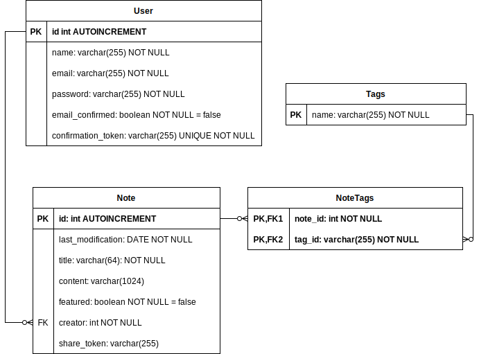

## Cele projektu

Celem projektu jest nauka nowych frameworków, bibliotek, metodologii w node.js

Między innymi:

- backend:
  - nestjs
  - pasport.js
  - typeORM
  - TypeScript
- frontend:

  - React
  - Redux
  - Material UI

- i inne ...

## Opis projektu

### Opis

Prosta aplikacja umożliwiająca tworzenie i zapisywanie notatek.

### Wymagania funkcjonalne

- [ ] logowanie:
  - [x] tworzenia kotna via e-mail
  - [ ] weryfikacja kont tworzonych via e-mail
  - [x] logowanie via email
  - [ ] logowanie za pomocą google
- [ ] CRUD notatek
  - [x] listowanie własnych notaktek
  - [x] usuwanie notatek
  - [ ] dodawanie notatek
  - [ ] listowanie notatak na podstawie tagu
  - [ ] listowanie notatek na podstawie fraz w tytule/ciele
- [x] sprawdzenie ilosci notatek o danym tagu
- [ ] podpowiadanie nazwy tagu przy jego dodawaniu do notatki
- [ ] udostępnianie notatki przez link
- [ ] odczytywanie notatek w trybie offline
  - [ ] synchronizacja lokalnych notetek z serwerem

### Schemat bazy danych

